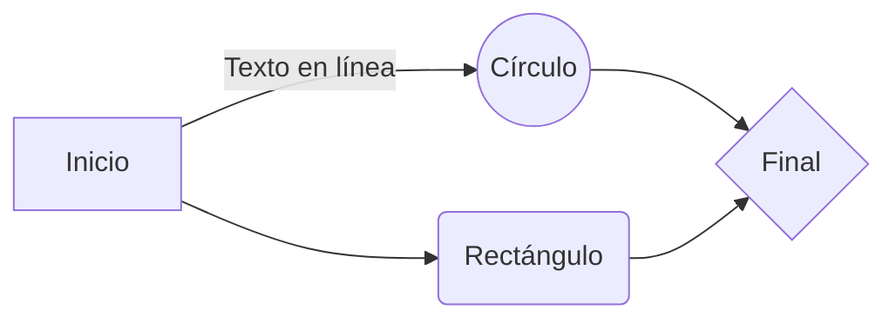

# Documento Markdown Izan Lanaspa
## Información variada
Este es un documento Markdown de prueba creado para el módulo **M1 - Sistemas Informáticos**.
Markdown es un *lenguaje de marcas* ligero, que es conocido por tener una sintaxis simple y fácil de entender, ya que es básicamente un texto plano, sencillo de escribir y entender, para después poder pasarlo a otros lenguajes cómo **HTML**.
## Realizar tablas
Las *tablas* en Markdown se ven de esta manera:
|                |SMX                            |DAW                          |ASIX		  |
|----------------|-------------------------------|-----------------------------|--------------|
|Tipo de grado   |Medio            			     |Superior            		   |Superior      |
|Total de módulos|14					         |12                           |14			  |
## Insertar enlaces
De esta manera puedes insertar enlaces en texto de Markdown:  
[YouTube](https://www.youtube.com/)  
[Instagram](https://www.instagram.com/)  
[FaceBook](https://es-la.facebook.com/)
## Diagrama de flujo
Los *diagramas de flujo* en Markdown se ven de esta manera:

## Comandos
Así se realiza una *caja de comandos* en Markdown:
```
sudo su
```
